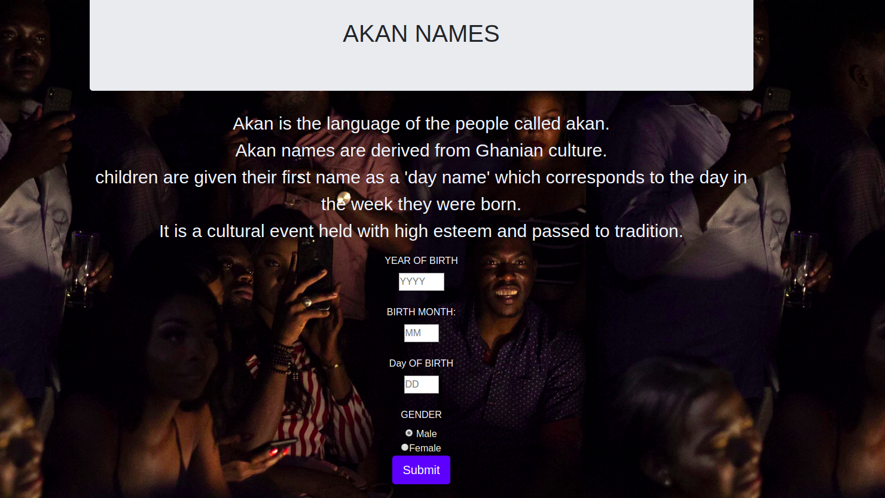

### PROJECT NAME
- AKAN NAMES

## PROJECT DESCRIPTION
- This project mainly shows JavaScript interactivity through selection of Akan names according to the date of birth.
The Akan people of Ghana frequently name their children after the day of the week they were born and the order in which they were born. These "day names" have further meanings concerning the soul and character of the person. So when you fill your birth credentials you are ssigned an Akan name .
## AUTHORS NAME
 - CATHERINE NDUKU
## SETUP INSTRUCTIONS
- You need network connection for the website to run effectively 
- You required to fill your birth Year.Month and Day inorder to get your Akan Name
## TECHNOLOGY USED
- HTML
  - used HTML to display the Content .
- CSS
   - Used CSS and Bootstrap css for styling .
- JAVASCRIPT
   - Used Javascript for interactivity through the selection of Akan names which match with Year of birth ,Month and Day .

## BDD
  - 
## PROJECTS LIVE LINK 

## CONTACT INFORMATION 

## LICENSE 